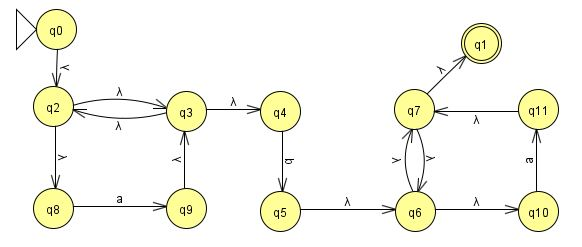

# Programa en Perl de un AFN
## Datos personales
- **Nombre:**       Julieta Rodríguez Espiricueta  
- **Carrera:**      Ingeniería en Tecnologías de la Información (ITI)  
- **Profesor:**     Juan Carlos González Ibarra  
- **Institución:**	Universidad Politécnica de San Luis Potosí  
- **Matrícula:**    180024

**Código hecho en colaboración con _Diana Rodríguez Espiricueta (170010)_**

## Descripción
Programa que recrea el funcionamiento de un Autómata Finito No Determinístico (AFN), en particular el reconocimiento de cadenas.  
Se valida la expresión regular a *ba*; para entender este concepto, es necesario explicar el significado del asterisco dentro de esta expresión.  

> En informática, el asterisco se emplea habitualmente como una expresión regular para denotar cero o más repeticiones de un patrón.

En otras palabras, la letra "a" se repite cero, una o infinidad de veces, mientras que la letra "b" solamente puede aparecer una vez en toda la cadena, siempre rodeada de a*.

El autómata que recrea el comportamiento de la expresión regular a* ba* es el siguiente:


La siguiente tabla ilustra las transiciones que debe de realizar este autómata:  

| Estado | ε | a | b | Fin de cadena |
| :---: | :---: | :---: |  :---: |  :---: |
| q<sub>0</sub> | q<sub>1</sub> | Error |  Error |  Error |
| q<sub>1</sub> | q<sub>2</sub>, q<sub>4</sub> | Error | Error |  Error |
| q<sub>2</sub> | Error | q<sub>3</sub> | Error |  Error |
| q<sub>3</sub> | q<sub>4</sub> | Error | Error |  Error |
| q<sub>4</sub> | q<sub>1</sub>, q<sub>5</sub> | Error | Error |  Error |
| q<sub>5</sub> | Error | Error | q<sub>6</sub> |  Error |
| q<sub>6</sub> | q<sub>7</sub> | Error | Error |  Error |
| q<sub>7</sub> | q<sub>8</sub>, q<sub>10</sub> | Error | Error |  Error |
| q<sub>8</sub> | Error | q<sub>9</sub> | Error |  Error |
| q<sub>9</sub> | q<sub>10</sub> | Error | Error |  Error |
| q<sub>10</sub> | q<sub>7</sub>, q<sub>11</sub> | Error | Error |  Error |
| q<sub>f</sub> | Error | Error | Error |  Aceptación |


## Sintaxis
En Perl, es posible utilizar los comandos para expresiones regulares que el propio lenguaje ya tiene por defecto. Entre estas expresiones se encuentra `=~`:  
    
    "Hello World" =~ /World/;		# |  Se encuentra el patrón en la cadena  


#### Comandos para validar caracteres
    $character =~ m[a]	# |  Reconoce si hay un caracter "a"
    
    $character =~ m[b]	# |  Reconoce si hay un caracter "b"
    
    $character eq $fin	# |  Reconoce si hay un espacio vacío

#### Función base para la generación de la tabla
```
#  Esta es la tabla de transiciones del automata AFN creado
#	       a | b | Vacío
my @tabla =  (  [1, 5, 20],	# |  q0
		[2, 5, 20],	# |  q1
		[3, 5, 20],	# |  q2
		[4, 5, 20],	# |  q3
		[1, 5, 20],	# |  q4
		[6, 20, 21],	# |  q5
		[7, 20, 21],	# |  q6
		[8, 20, 21],	# |  q7
		[9, 20, 21],	# |  q8
		[10, 20, 21],	# |  q9
		[11, 20, 21],	# |  q10
		[7, 20, 21] );	# |  q11
```


## Problemas y soluciones al programar  
La generación de la tabla de transiciones se realizó a partir del modelo proporcionado por nuestro profesor. Debido a que sería muy difícil utilizar caracteres para validar estas transiciones, se optó por utilizar números, otorgándole uno distinto para cada estado válido o inválido.

De igual manera, el programa termina cuando se detecta un espacio en blanco, pero las cadenas en Perl agregan un salto de línea automáticamente, obstruyendo esta instrucción. Para corregir este problema, se utilizó la función `chomp()`, la cual elimina la reserva el símbolo de \n.
```
my $caden = <STDIN>;			# |  Captura de la cadena por teclado
chomp $caden;				# |  Se le quita el salto de línea
my $cadena = $caden . " ";		# |  Se le concatena un espacio vacío al final
my @cadena = split (//, $cadena);	# |  La cadena se convierte en un arreglo
```
